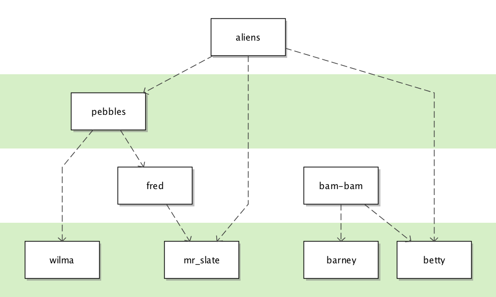
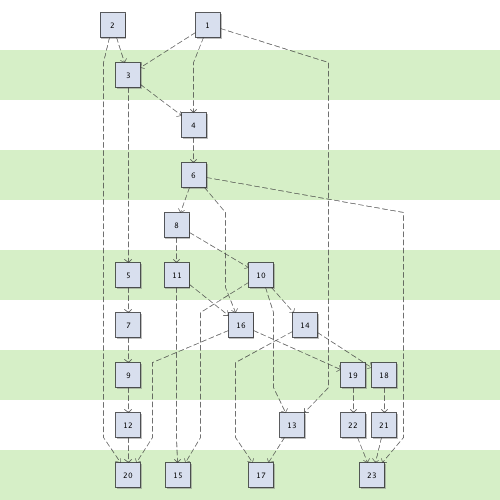
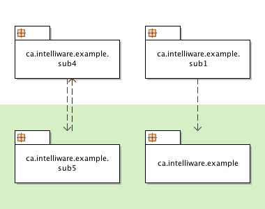
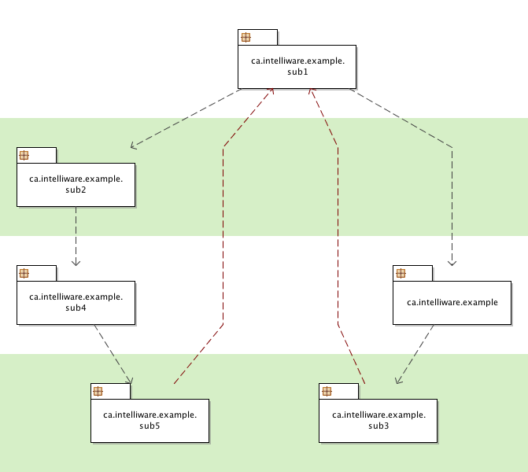
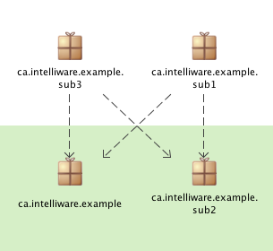

# dependency-graph

THIS REPOSITORY HAS BEEN MOVED INTO A SUBFOLDER OF THE [dependency](https://github.com/Intelliware/dependency) REPO.

This codebase implements the Sugiyama Algorithm for visually representing [layered
graphs](https://en.wikipedia.org/wiki/Layered_graph_drawing "Wikipedia"). It makes use of the
[Dependency](https://github.com/Intelliware/dependency "Dependency project on GitHub")
project to keep track of dependencies between different items.

As discussed in the README.md for
[Dependency](https://github.com/Intelliware/dependency "Dependency project on GitHub"),
one of the original rationales for the codebase was to visually represent package
dependencies, and as a result, that's the case that's been most tested.

## Samples

Here are some examples of layered graphs created by this code. The code that created
these graphs can be found in the
[test folder in the graph/shape package](https://github.com/Intelliware/dependency-graph/tree/master/src/test/java/ca/intelliware/commons/dependency/graph/shape).

### Simple Boxes

This sample shows a simple layered graph with simple, non-cyclic dependencies.

### More Complex Example

This sample shows a larger number of layers and dependencies, but the structure is
still fairly simple:

### Basic Cycles

Here's an example showing a very simple package arrangement, with a cyclic dependency:

### More Complex Cycles

And here's a more complex arrangement with cycles:

### Crossing Arrows

Not all [DiGraphs](https://en.wikipedia.org/wiki/Directed_graph "Directed Graph on Wikipedia")
can be represented without lines crossing. Here's a simple
example that cannot be drawn in a way that preserves layers without also including
line crossings:

